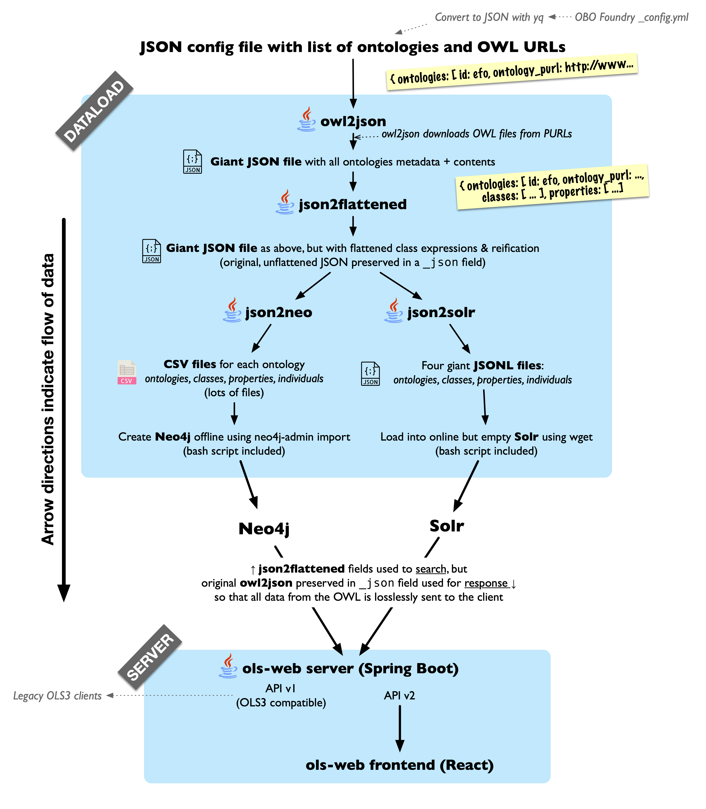

OLS4 is available at <b>[https://www.ebi.ac.uk/ols4/](https://www.ebi.ac.uk/ols4/)</b>. Please report any issues to the
tracker in this repository.

---

Version 4 of the EMBL-EBI Ontology Lookup Service (OLS), featuring:

* Much faster dataload (loads the OBO foundry in hours instead of days)
* Modular dataload pipeline with decoupled, individually testable stages
* Automated CI testing of the dataload with minimal testcase ontologies
* A lossless data representation: everything in the ontology is preserved in the databases
* Coverage of the whole OWL2 spec, and also loads vocabularies defined purely in RDFS
* Uses updated versions of Solr and Neo4j (no embedded databases, no MongoDB)
* React frontend using Redux and Tailwind
* Backwards compatibility with the OLS3 API

This repository contains three projects:

* The dataloader (`dataload` directory)
* The API server (`backend` directory)
* The React frontend (`frontend` directory)

# Deploying OLS4

If you want to try OLS4 out, this should get you going:

    export OLS4_CONFIG=./dataload/configs/efo.json
    docker compose up

You should now be able to access the OLS4 frontend at `http://localhost:8081`.

If you need to set the heap size, you can do so using:

    JAVA_OPTS="-Xms5G -Xmx25G"  docker compose up

If you want to test it with your own ontology, copy the OWL or RDFS ontology file to the `testcases` folder (which is
mounted in Docker). Then make a new config file for your ontology in `dataload/configs` (you can use `efo.json` as a
template). For the `ontology_purl` property in the config, use e.g. `file:///opt/dataload/testcases/myontology.owl` if
your ontology is in `testcases/myontology.owl`. Then follow the above steps for efo with the config filename you
created.

## Deployment: Using Kubernetes with GitHub Packages

To deploy OLS4 using Kubernetes, Docker images built and uploaded to this repository (using GitHub Packages) are
utilized. Software requirements are as follows:

1. Kubernetes command-line tool, _kubectl_
2. Kubernetes package manager, _helm_

### Create data archives for Solr and Neo4j

To create your own Solr and Neo4j data archives, follow the steps on [how to load data locally](#running-the-dataload-locally).

### Startup dataserver

Uninstall existing `dataserver` deployments, if any, before installing a new one. Do not forget to set `KUBECONFIG`
environment variable.

    export KUBECONFIG=<K8S_CONFIG>
    helm install ols4-dataserver --wait <OLS4_DIR>/k8chart/dataserver

### Copy data to dataserver

From your local directory, copy the Solr and Neo4j data archive files to the `dataserver`.

    kubectl cp <LOCAL_DIR>/neo4j.tgz $(/srv/data/k8s/kubectl get pods -l app=ols4-dataserver -o custom-columns=:metadata.name):/usr/share/nginx/html/neo4j.tgz
    kubectl cp <LOCAL_DIR>/solr.tgz $(/srv/data/k8s/kubectl get pods -l app=ols4-dataserver -o custom-columns=:metadata.name):/usr/share/nginx/html/solr.tgz

### Startup OLS4 deployment

Uninstall existing `ols4` deployments, if any, before installing a new one. Do not forget to set `KUBECONFIG`
environment variable.

**IMPORTANT**: The use of `imageTag` is to specify the Docker image (uploaded to this repository) that will be used in the deployment. If not familiar, simply
use either the `dev` or `stable` image.

    export KUBECONFIG=<K8S_CONFIG>
    helm install ols4 <OLS4_DIR>/k8chart/ols4 --set imageTag=dev

# Developing OLS4

OLS is different to most webapps in that its API provides both full text search and recursive graph queries, neither of
which are possible and/or performant using traditional RDBMS. It therefore uses two specialized database servers: [**Solr**](https://solr.apache.org), a Lucene server similar to ElasticSearch; and [**Neo4j**](https://neo4j.com), a graph
database.

* The `dataload` directory contains the code which turns ontologies from RDF (specified using OWL and/or RDFS) into JSON
  and CSV datasets which can be loaded into Solr and Neo4j, respectively; and some minimal bash scripts which help with
  loading them.
* The `backend` directory contains a Spring Boot application which hosts the OLS API over the above Solr and Neo4j
  instances
* The `frontend` directory contains the React frontend built upon the `backend` above.

## Development: Running OLS4 using Docker

You can run OLS4, or any combination of its consistuent parts (dataload, backend, frontend) in Docker. When developing,
it is often useful to run, for example, just Solr and Neo4j in Docker, while running the API server locally; or to run
Solr, Neo4j, and the backend API server in Docker while running the frontend locally.

First install the latest version of Docker Desktop if you are on Mac or Windows. This now includes the `docker compose`
command. If you are on Linux, make sure you have the `docker compose` plugin
installed (`apt install docker.io docker-compose-plugin` on Ubuntu).

You will need a config file, which configures the ontologies to load into OLS4. You can provide this to `docker compose`
using the `OLS4_CONFIG` environment variable. For example:

	export OLS4_CONFIG=./dataload/configs/efo.json

Then, start up the components you would like to run. For example, Solr and Neo4j only (to develop the backend API server
and/or frontend):

    docker compose up --force-recreate --build --always-recreate-deps --attach-dependencies ols4-solr ols4-neo4j

This will build and run the dataload, and start up Solr and Neo4j with your new dataset on ports 8983 and 7474,
respectively. To start Solr and Neo4j **AND** the backend API server (to develop the frontend):

    docker compose up --force-recreate --build --always-recreate-deps --attach-dependencies ols4-solr ols4-neo4j ols4-backend

To start everything, including the frontend:

    docker compose up --force-recreate --build --always-recreate-deps --attach-dependencies ols4-solr ols4-neo4j ols4-backend ols4-frontend

## Development: Running OLS4 locally

Alternatively, you can run OLS4 or any of its constituent parts locally, which is more useful for development. Software
requirements are as follows:

1. Java 11. Later versions of Java are probably fine, though the Neo4j we use only works with Java 11.
2. Maven 3.x.x
3. Neo4J 4.4.x
4. Solr 9.0.0
5. Your favourite Git client

### Acquire source and build

Clone repo:

    git clone git@github.com:EBISPOT/ols4.git

Build backend:

    mvn clean package

Build frontend:

    npm install

### Test testcases from dataload to UI

The scripts below assume you have the following environment variables set:

`NEO4J_HOME`

`SOLR_HOME`

`OLS4_HOME` - this should point to the root folder where you have the OLS4 code.

Change the directory to $OLS4_HOME.

    cd $OLS4_HOME

To load a testcase and start Neo4J and Solr, run:

    ./dev-testing/teststack.sh <rel_json_config_url> <rel_output_dir>

where `<rel_json_config_url>` can be a JSON config file or a directory with JSON file, and `<rel_outdir>`
the output directory, both relative from $OLS4_HOME, i.e.:

    ./dev-testing/teststack.sh ./testcases/owl2-primer/minimal.json ./output

or if you want to load all testcases, you can use

    ./dev-testing/teststack.sh ./testcases ./output

If you need to set the Java heap size, you can set the environment the JAVA_OPTS variable as follows:

     export JAVA_OPTS="-Xms5G -Xmx10G"

Once Neo4J and Solr is up, to start the backend (REST API) you can run:

    ./dev-testing/start-backend.sh

Once the backend is up, you can start the frontend with:

    ./dev-testing/start-frontend.sh

Once you are done testing, to stop everything:

    ./stopNeo4JSolr.sh

### Running the dataload locally

All related files for loading and processing data are in `dataload`.
First, make sure the configuration files (that determine which ontologies to load) are ready and to build all the JAR files:

    cd dataload
    mvn clean package

#### Pre-download RDF

    java \
    -DentityExpansionLimit=0 \
    -DtotalEntitySizeLimit=0 \
    -Djdk.xml.totalEntitySizeLimit=0 \
    -Djdk.xml.entityExpansionLimit=0 \
    -jar predownloader.jar \
    --config <CONFIG_FILE> \
    --downloadPath <DOWNLOAD_PATH>

#### Convert RDF to JSON

    java \
    -DentityExpansionLimit=0 \
    -DtotalEntitySizeLimit=0 \
    -Djdk.xml.totalEntitySizeLimit=0 \
    -Djdk.xml.entityExpansionLimit=0 \
    -jar rdf2json.jar \
    --downloadedPath <DOWNLOAD_PATH> \
    --config <CONFIG_FILE> \
    --output <LOCAL_DIR>/output_json/ontologies.json

#### Run ontologies linker

    java \
    -jar linker.jar \
    --input <LOCAL_DIR>/output_json/ontologies.json \
    --output <LOCAL_DIR>/output_json/ontologies_linked.json \
    --leveldbPath <LEVEL_DB_DIR>

#### Convert JSON to Neo4j CSV

    java \
    -jar json2neo.jar \
    --input <LOCAL_DIR>/output_json/ontologies_linked.json \
    --outDir <LOCAL_DIR>/output_csv/

#### Create Neo4j from CSV

Run Neo4j `import` command:

    ./neo4j-admin import \
    --ignore-empty-strings=true \
    --legacy-style-quoting=false \
    --array-delimiter="|" \
    --multiline-fields=true \
    --database=neo4j \
    --read-buffer-size=134217728 \
    $(<LOCAL_DIR>/make_csv_import_cmd.sh)

Here is a sample `make_csv_import_cmd.sh` file:

    for f in ./output_csv/*_ontologies.csv
    do
    echo -n "--nodes=$f "
    done
    
    for f in ./output_csv/*_classes.csv
    do
    echo -n "--nodes=$f "
    done
    
    for f in ./output_csv/*_properties.csv
    do
    echo -n "--nodes=$f "
    done
    
    for f in ./output_csv/*_individuals.csv
    do
    echo -n "--nodes=$f "
    done
    
    for f in ./output_csv/*_edges.csv
    do
    echo -n "--relationships=$f "
    done

#### Make Neo4j indexes

Start Neo4j locally and then run the sample database commands, which are also defined in `create_indexes.cypher` inside the `dataload` directory:

    CREATE INDEX FOR (n:OntologyClass) ON n.id;
    CREATE INDEX FOR (n:OntologyIndividual) ON n.id;
    CREATE INDEX FOR (n:OntologyProperty) ON n.id;
    CREATE INDEX FOR (n:OntologyEntity) ON n.id;
    
    CALL db.awaitIndexes(10800);

After creating the indexes, stop Neo4j as needed.

#### Convert JSON output to Solr JSON

    java \
    -jar json2solr.jar \
    --input <LOCAL_DIR>/output_json/ontologies_linked.json \
    --outDir <LOCAL_DIR>/output_jsonl/

#### Update Solr indexes

Before running Solr, make sure to copy the configuration (`solr_config`) from inside `dataload` directory to local, e.g., `<SOLR_DIR>/server/solr/`.
Then, start Solr locally and use the generated JSON files to update. See sample commands below:

    wget \
    --method POST --no-proxy -O - --server-response --content-on-error=on \
    --header="Content-Type: application/json" \
    --body-file <LOCAL_DIR>/output_jsonl/ontologies.jsonl \
    http://localhost:8983/solr/ols4_entities/update/json/docs?commit=true
    
    wget \
    --method POST --no-proxy -O - --server-response --content-on-error=on \
    --header="Content-Type: application/json" \
    --body-file <LOCAL_DIR>/output_jsonl/classes.jsonl \
    http://localhost:8983/solr/ols4_entities/update/json/docs?commit=true
    
    wget --method POST --no-proxy -O - --server-response --content-on-error=on \
    --header="Content-Type: application/json" \
    --body-file <LOCAL_DIR>/output_jsonl/properties.jsonl \
    http://localhost:8983/solr/ols4_entities/update/json/docs?commit=true
    
    wget --method POST --no-proxy -O - --server-response --content-on-error=on \
    --header="Content-Type: application/json" \
    --body-file <LOCAL_DIR>/output_jsonl/individuals.jsonl \
    http://localhost:8983/solr/ols4_entities/update/json/docs?commit=true
    
    wget --method POST --no-proxy -O - --server-response --content-on-error=on \
    --header="Content-Type: application/json" \
    --body-file <LOCAL_DIR>/output_jsonl/autocomplete.jsonl \
    http://localhost:8983/solr/ols4_autocomplete/update/json/docs?commit=true

Update `ols4_entities` core:

    wget --no-proxy -O - --server-response --content-on-error=on \
    http://localhost:8983/solr/ols4_entities/update?commit=true

Update `ols4_autocomplete` core:

    wget --no-proxy -O - --server-response --content-on-error=on \
    http://localhost:8983/solr/ols4_autocomplete/update?commit=true

After updating the indexes, stop Solr as needed.

#### Create data archives for Solr and Neo4j

Finally, create archives for both Solr and Neo4j data folders.

    tar --use-compress-program="pigz --fast --recursive" \
    -cf <LOCAL_DIR>/neo4j.tgz -C <LOCAL_DIR>/neo4j/data .

    tar --use-compress-program="pigz --fast --recursive" \
    -cf <LOCAL_DIR>/solr.tgz -C <LOCAL_DIR>/solr/server solr

### Running the API server backend locally

The API server Spring Boot application located in `backend`. Set the following environment variables to point it at your
local (Dockerized) Solr and Neo4j servers:

    OLS_SOLR_HOST=http://localhost:8983
    OLS_NEO4J_HOST=bolt://localhost:7687

### Running the frontend locally

The frontend is a React application in `frontend`. See [frontend docs](frontend/README.md)
for details on how to run the frontend.

## Development: Updating `testcases_expected_output` and `testcases_expected_output_api`
If you make changes to the data load or API of OLS, you need to run testcases and compare it against the expected outputs 
to ensure backward compatibility. This testing consists of 

1. testing the dataload outputs by comparing test outputs to expected outputs,
2. API testing which compares API responses to expected responses, and
3. adding the latest expected outputs to Git.

### Testing dataload
These tests are run locally as described in [Test testcases from dataload to UI](#test-testcases-from-dataload-to-ui).
Ensure that the environment variables `NEO4J_HOME`, `SOLR_HOME` and `OLS4_HOME` are set up accordingly.

1. First make sure all the OLS4 JARs are up to date by running :
 
       mvn clean package

2. Generate new output files and import into Neo4J and Solr: 

       ./dev-testing/teststack.sh ./testcases ./testcases_output

3. Compare `/testcases_output` with `/testcases_expected_output`:

       ./compare_testcase_output.sh

4. The output of step 3 is written to `testcases_compare_result.log`. If no differences are found, this file will be empty. 
Ensure that all differences in this file can be explained and that they do make sense.

5. Once you are happy with the output in `testcases_output`, remove the old `testcases_expected_output` and replace with
new expected output:

       rm -rf testcases_expected_output
       cp -r testcases_output/testcases testcases_expected_output

6. Now continue with API testing.

### Testing API
Before doing API testing you must have completed the [dataload testing](#testing-dataload).

7. Start the backend:

        ./dev-testing/start-backend.sh

8. Run API tests against backend using: 

       ./test_api_fast.sh http://localhost:8080 ./testcases_output_api ./testcases_expected_output_api --deep

9. The results of step 8 is written to `./apitester4.log`. Differences are written to the end of the file. When there are no
differences, this file will end with these lines:

       RecursiveJsonDiff.diff() reported success
       apitester reported success; exit code 0

10. Ensure that all differences listed in `./apitester4.log` are accounted for. Once you are happy with the output, remove 
the old `testcases_expected_output_api` and replace with new expected output: 

        rm -rf testcases_expected_output_api
        cp -r testcases_output testcases_expected_output_api

11. Add the latest expected outputs to Git:

        git add -A testcases_expected_output
        git add -A testcases_expected_output_api

    **You should do this in the same commit as your code/test changes because then we can track exactly
    what changed in the output.**

12. You can stop the OLS4 backend with "Ctrl-C", and Solr and Neo4J with:

        ./dev-testing/stopNeo4JSolr.sh

