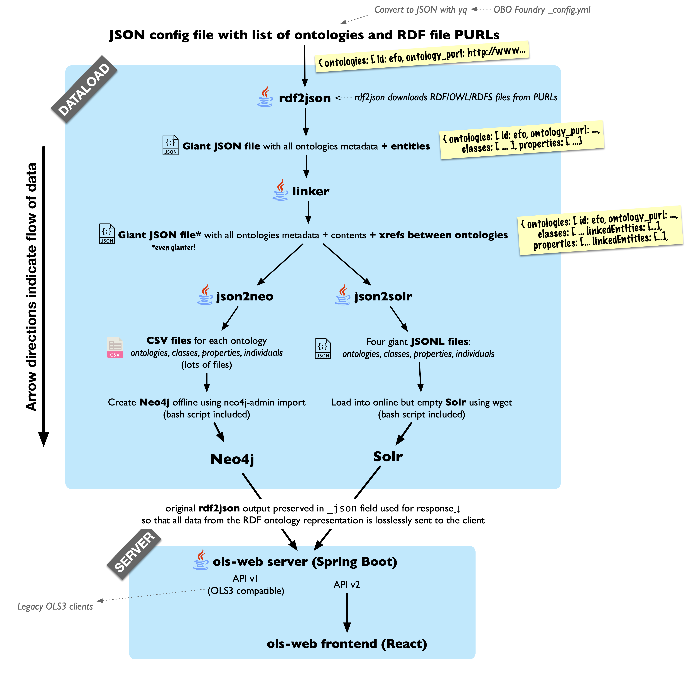

Work in progress

Version 4 of the EMBL-EBI Ontology Lookup Service (OLS), featuring:

* Much faster dataload (load the OBO foundry in hours instead of days)
* Modular dataload pipeline with decoupled, individually testable stages
* Automated CI testing of the dataload with minimal testcase ontologies
* A lossless data representation: everything in the OWL is preserved in the databases
* Support for the latest Solr and Neo4j (no embedded databases, no MongoDB)
* React frontend using Redux and Tailwind
* Backwards compatibility with the OLS3 API

This repository contains both the dataloader (`dataload` directory) and the API/webapp server (`server` directory).

# Deploying OLS4

Deployment instructions will go here. OLS4 is still under heavy development, so currently we only have instructions for developers below.

# Developing OLS4

OLS is different to most webapps in that its API provides both full text search and recursive graph queries, neither of which are possible and/or performant using traditional RDBMS.
It therefore uses two specialized database servers: [**Solr**](https://solr.apache.org), a Lucene server similar to ElasticSearch; and [**Neo4j**](https://neo4j.com), a graph database. 

The `dataload` directory contains the code which turns OWL ontologies into JSON and CSV datasets which can be loaded into Solr and Neo4j, respectively; and some minimal bash scripts which help with loading them.

The `server` directory contains (1) a Spring Boot application which hosts the OLS API over the above Solr and Neo4j instances; and (2) a React frontend built upon the OLS API.

## Running Solr and Neo4j using Docker

First install the latest version of Docker Desktop if you are on Mac or Windows. This now includes the `docker compose` command. If you are on Linux, make sure you have the `docker compose` plugin installed (`apt install docker.io docker-compose-plugin` on Ubuntu).

You will need a config file, which configures the ontologies to load into OLS4. You can provide this to `docker compose` using the `OLS4_CONFIG` environment variable. For example:

	export OLS4_CONFIG=./dataload/configs/efo.json

Then, build and run Solr and Neo4j:

    docker compose up --force-recreate --build --always-recreate-deps --attach-dependencies ols4-solr ols4-neo4j

This will build and run the dataload, and start up Solr and Neo4j with your new dataset on ports 8983 and 7474, respectively.  Now you can run the API server Spring Boot application located in `server` and frontend for development.  Set the following environment variables to point it at your local (Dockerized) Solr and Neo4j servers:

    OLS_SOLR_HOST=http://localhost:8983
    OLS_NEO4J_HOST=bolt://localhost:7687

The frontend is a React application in `server/frontend`. TODO instructions!

## Updating `testcases_expected_output`

If you change something that results in the test output changing (e.g. adding new tests, changing what the output looks like), the CI on this repo will fail.

To fix this, you need to replace the `testcases_expected_output` and `testcases_expected_output_api` folders with the new expected output. **You should do this in the same commit as your code/test changes because then we can track exactly what changed in the output.**

First make sure all the JARs are up to date:

    mvn clean package

Then run the test scripts:

* `./test_dataload.sh` (~1 minute) will test the dataload locally, updating `testcases_expected_output`. All you need is Java and Maven.
* `./test_api.sh` (~15 mins) will test the entire OLS4 stack (dataload → solr/neo4j → api server) using Docker compose to bring up and tear down all the services for each testcase, updating `testcases_expected_output_api`. You need to have Docker and Docker compose installed.

To run both:

    ./test_dataload.sh
    ./test_api.sh

Now remove the existing expected output:

    rm -rf testcases_expected_output
    rm -rf testcases_expected_output_api

Copy your new output to the respective directories:

    cp -r testcases_output testcases_expected_output
    cp -r testcases_output_api testcases_expected_output_api

You can now add it to your commit:

    git add -A testcases_expected_output
    git add -A testcases_expected_output_api

    

